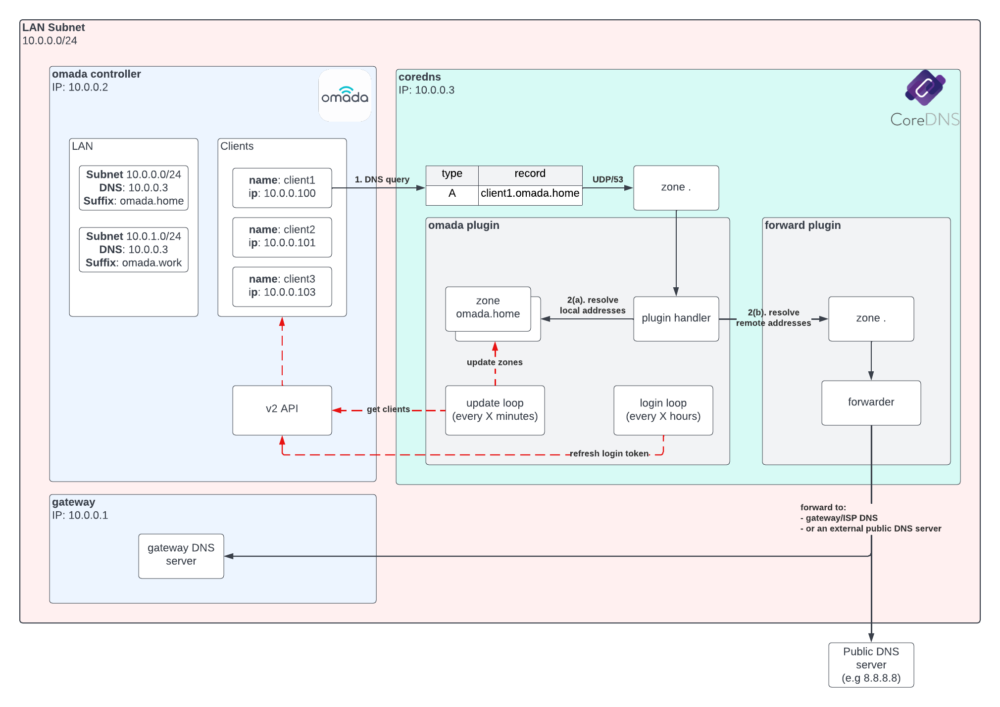

# coredns-omada-plugin

coredns_omada is a [CoreDNS plugin](https://coredns.io/manual/plugins/) which resolves local DNS addresses for clients on TP-Link Omada SDN networks. It uses the omada API to periodically get a list of client addresses.

# Getting started

CoreDNS plugins need to be compiled into CoreDNS, you can follow the [build instructions](docs/build.md) to build the binaries or use the provided docker images.

## using docker:

- requires a `Corefile` in the current directory
- set the url/username/password accordingly

```
docker run \
--rm -it -m 128m \
--expose=53 --expose=53/udp -p 53:53 -p 53:53/udp \
-v "$PWD"/Corefile:/etc/coredns/Corefile \
--env OMADA_URL="<OMADA_URL>" \
--env OMADA_USERNAME="<OMADA_USERNAME>" \
--env OMADA_PASSWORD="<OMADA_PASSWORD>" \
--env OMADA_DISABLE_HTTPS_VERIFICATION="true" \
--env DNS_FORWARD="8.8.8.8" \
dougbw1/coredns-omada:1.0.0 -conf /etc/coredns/Corefile
```

## using k8s:
Manifest files to get started are in the [k8s](k8s) directory

# Configuration

CoreDNS is configured using a configuration file called a [Corefile](https://coredns.io/2017/07/23/corefile-explained/) which supports [variable substitution](https://coredns.io/manual/configuration/#environment-variables) so values can be provided using environment variables.

## Plugin Configuration variables

| property            | Required | Type   | Notes                                                      |
| ------------------- | -------- | ------ | ---------------------------------------------------------- |
| controller_url      | ✅       | string | address of the Omada controller. Include `https://` prefix |
| username            | ✅       | string | Omada controller username                                  |
| password            | ✅       | string | Omada controller password                                  |
| refresh_minutes     | ❌       | int    | how often to refresh the zones (default 1 minute)          |
| refresh_login_hours | ❌       | int    | how often to refresh the login token (default 24 hours)    |

# Credentials

For this service you should create a new user in the `Admin` page of the controller with a `Viewer` role.

# HTTPS Verification

This will depend on your network and configuration, but due to the lack of a suitable internal DNS resolution you may need to disable HTTPS verification to the controller, as even if you have a valid certificate on your controller you need a valid DNS record pointing to your controller where coredns is running.

HTTPS verification can be disabled by setting environment variable `OMADA_DISABLE_HTTPS_VERIFICATION` to `true`

An option to keep HTTPS verification enabled is to create a public DNS A record pointing to your controllers private IP address.

## Corefile example

See [Corefile](Corefile)

```
. {
    omada {
        controller_url {$OMADA_URL}
        username {$OMADA_USERNAME}
        password {$OMADA_PASSWORD}
        refresh_minutes 1
    }
    forward . {$DNS_FORWARD}
}
```

# Solution Design


