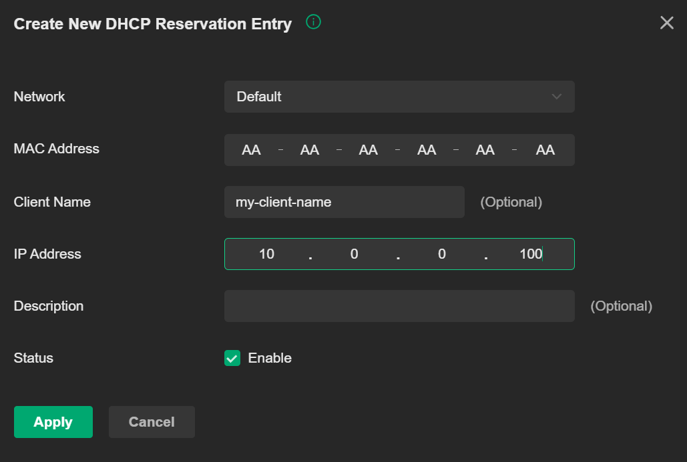

# Configuration

CoreDNS is configured using a configuration file called a [Corefile](https://coredns.io/2017/07/23/corefile-explained/) which supports [variable substitution](https://coredns.io/manual/configuration/#environment-variables) so values can be provided using environment variables.

## Corefile examples
Example corefiles are located [here](../corefile-examples)

## Omada plugin configuration syntax

| Name                      | Required | Type     | Notes                                                                                                                                                        |
|---------------------------|----------|----------|--------------------------------------------------------------------------------------------------------------------------------------------------------------|
| controller_url            | ✅        | string   | address of the Omada controller. Include `https://` prefix                                                                                                   |
| site                      | ✅        | string   | name of the site from the Omada controller (note this is a regex pattern)                                                                                    |
| username                  | ✅        | string   | Omada controller username                                                                                                                                    |
| password                  | ✅        | string   | Omada controller password                                                                                                                                    |
| fallback                  | ❌        | string   | IPv4 address, FQDN, or hostname to redirect unresolved queries within managed zones. Creates wildcard DNS records automatically. Empty string disables fallback |
| refresh_minutes           | ❌        | int      | How often to refresh the zones (default 1 minute)                                                                                                            |
| refresh_login_hours       | ❌        | int      | How often to refresh the login token (default 24 hours)                                                                                                      |
| resolve_clients           | ❌        | bool     | Whether to resolve client addresses (default true)                                                                                                                        |
| resolve_devices           | ❌        | bool     | Whether to resolve device addresses (default true)                                                                                                              |
| resolve_dhcp_reservations | ❌        | bool     | Whether to resolve device addresses (default true)                                                                                                                        |
| stale_record_duration     | ❌        | duration | How long to keep serving stale records for clients/devices which are no longer present in the Omada controller. Specified in Go time [duration](https://pkg.go.dev/time#ParseDuration) format |
| ignore_startup_errors | ❌        | bool     | ignore connection/configuration errors to the omada controller on startup. Set this to true if you want coredns to startup even if unable to connect to omada (default false)                                                                   |

## Credentials

For this service you should create a new user in the `Admin` page of the controller with a `Viewer` role.

## Omada Site

A single Omada controller can support multiple network sites. This plugin can be configured to use multiple sites via the `site` configuration property (regex). Multiple sites can be specified using the `|` separator like this `SiteA|SiteB|SiteC` or all sites can be selected by setting it to `.*`

## HTTPS Verification

This will depend on your network and configuration, but due to the lack of a suitable internal DNS resolution you may need to disable HTTPS verification to the controller, as even if you have a valid certificate on your controller you need a valid DNS record pointing to your controller where coredns is running.

HTTPS verification can be disabled by setting environment variable `OMADA_DISABLE_HTTPS_VERIFICATION` to `true`

An option to keep HTTPS verification enabled is to create a public DNS A record pointing to your controllers private IP address.

## Custom DNS records

It is possible to create a dummy DHCP reservation in the Omada controller to create custom DNS records.

* In the Omada controller go to `Settings` -> `Services` -> `DHCP Reservations`
* Create a new DHCP reservation:
    - Enter a dummy MAC address e.g AA-AA-AA-AA-AA-AA
    - Enter the desired IP address
    - Enter the client name
    - (If you are unable to set the client name then use the description - there is a fallback in the code for this and the options seem to vary across controller versions)
    - Example: 

Note that wildcard records are supported by setting the client name to `*.<subdomain>` e.g `*.apps`.

## Fallback Configuration

The `fallback` option provides automatic creation of a wildcard record. This is useful for automatically drecting to a reverse proxy across all zones. The created wildcard entry can also have a duplicate IP address to existing hostname records (unlike custom DNS records created by DHCP reservation).

The fallback can be configured as:

- **IP address**: Direct IP redirection (e.g., `192.168.1.100`)
- **FQDN**: Fully qualified domain name (e.g., `proxy.omada.home`)
- **Hostname**: Simple hostname that exists in your zones (e.g., `proxy`)

The FQDN and Hostname configurations must be able to resolve within the configured zones during updates as the wildcard entry will create an IP record.
